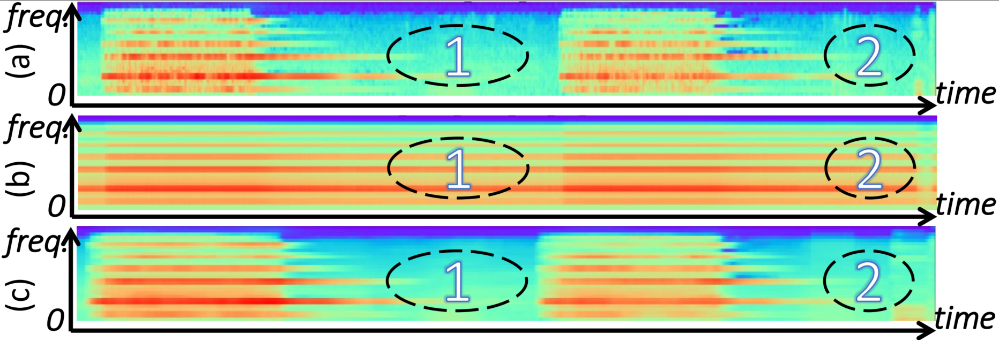

## Samples


<p><div align="center"> 
 Subgraph: (a) Log mel spectrogram; (b) Features after the self-attention; (c) Features after EDC. (Best viewed in color.) 
 
</div></p>
 
<br>
 
 [Link](https://github.com/Yuanbo2020/EDC/blob/main/samples/Comparison_fig.1.png) and 

### Markdown

Markdown is a lightweight and easy-to-use syntax for styling your writing. It includes conventions for

```markdown
Syntax highlighted code block

# Header 1
## Header 2
### Header 3

- Bulleted
- List

1. Numbered
2. List

**Bold** and _Italic_ and `Code` text

[Link](url) and 
```

For more details see [GitHub Flavored Markdown](https://guides.github.com/features/mastering-markdown/).

### Jekyll Themes

Your Pages site will use the layout and styles from the Jekyll theme you have selected in your [repository settings](https://github.com/Yuanbo2020/EDC/settings/pages). The name of this theme is saved in the Jekyll `_config.yml` configuration file.

### Support or Contact

Having trouble with Pages? Check out our [documentation](https://docs.github.com/categories/github-pages-basics/) or [contact support](https://support.github.com/contact) and we’ll help you sort it out.
