## Feature comparison (Best viewed in color) 
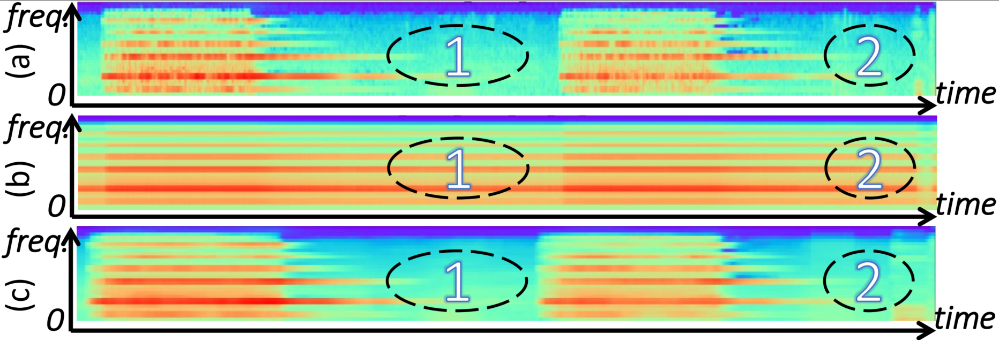

 
 Subgraph: (a) Log mel spectrogram; (b) Features after the self-attention; (c) Features after EDC.  

<!-- 在此处写注释-->
<!--

-->

## A detection demo of the siren sound clip
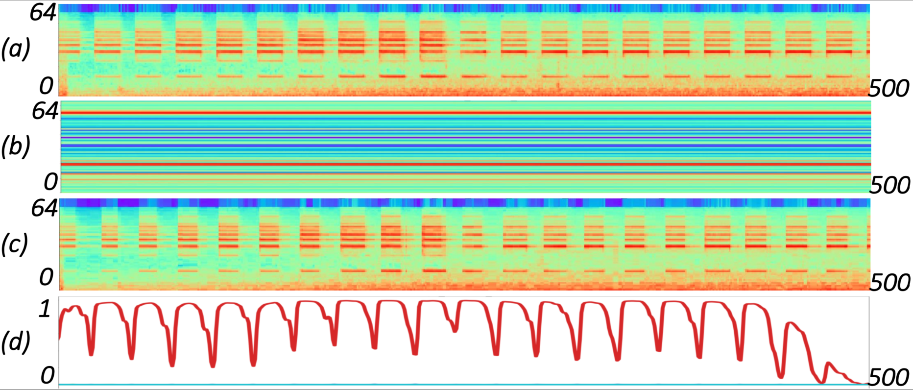

 
Subgraph: (a) Log mel spectrogram; (b) Bottleneck features from the trainable self-attention layer; (c) Acoustic features after EDC; (d) The probability of events
predicted by the model trained with EDC.   

## Visualization of frame-level representations distribution
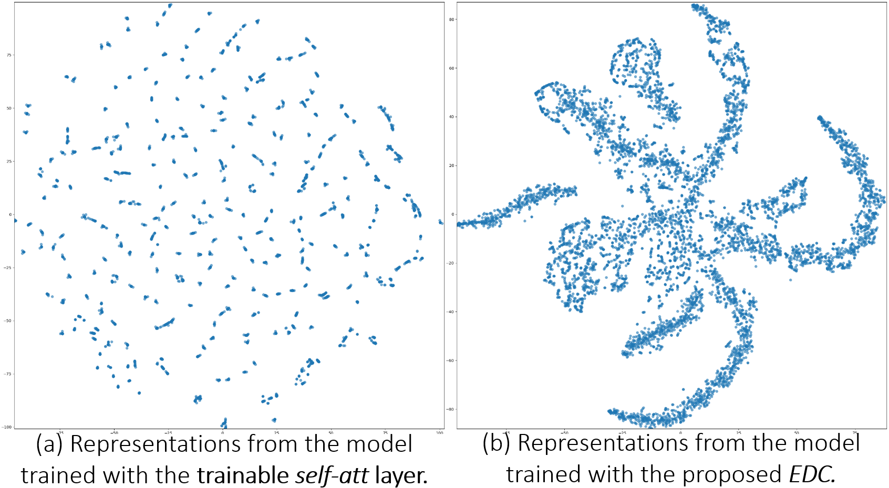

 
Visualization of frame-level representations distribution using unsupervised t-SNE. 
Please note that models in this paper are trained by clip-level weak labels in datasets of DCASE and CHiME, and the label of each audio clip is a multi-hot vector, so the label corresponding to the frame-level representation is unknowable.  

## The calculation procedure of EDC
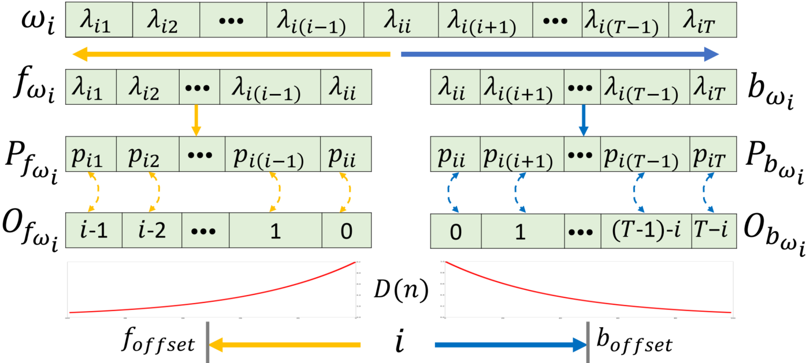

 
For the souce code, please see <a href="https://github.com/Yuanbo2020/EDC/tree/main/Code" 
target="https://github.com/Yuanbo2020/EDC/tree/main/Code/">here</a>.

## Attenuation curves of different alpha
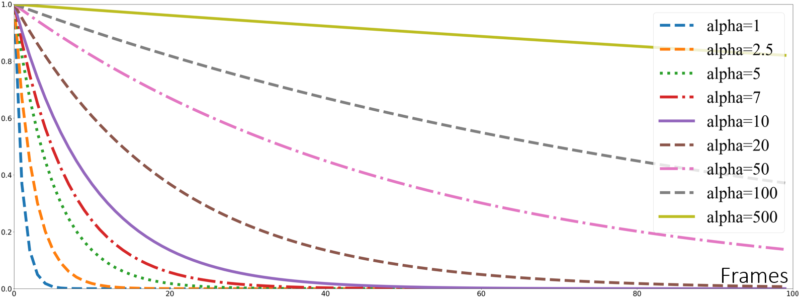

 
Assuming that the attenuation starts from frame 0

## Model structure
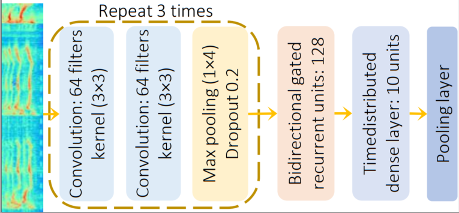

 
For the souce code, please see <a href="https://github.com/Yuanbo2020/EDC/tree/main/Code" 
target="https://github.com/Yuanbo2020/EDC/tree/main/Code/">here</a>.

## Experimental results
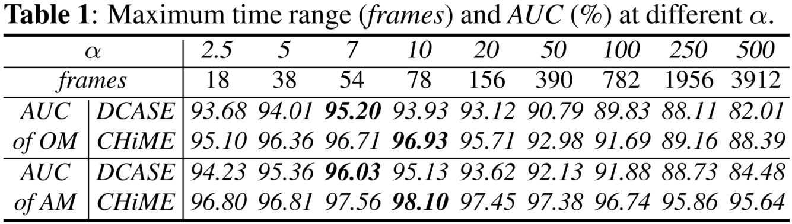
 
 
 
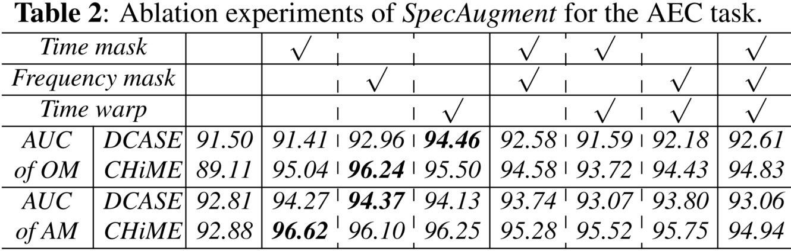
 
 
 

## Further comparison of the effects of EDC
### Sample 1
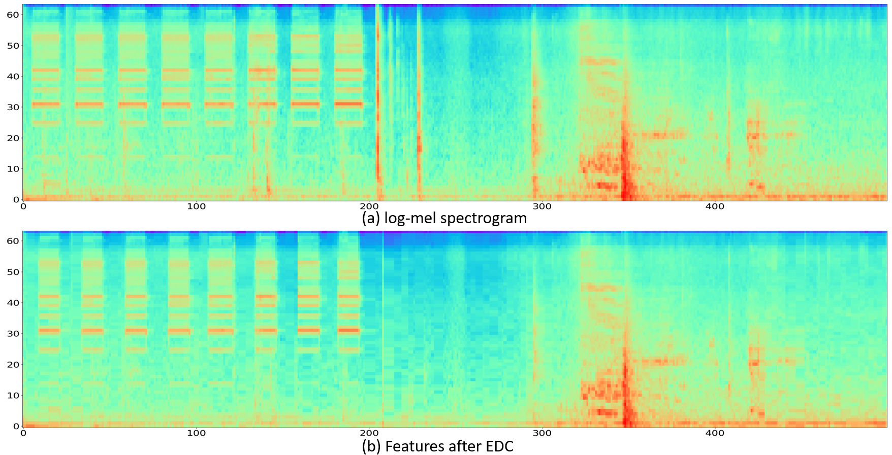

### Sample 2
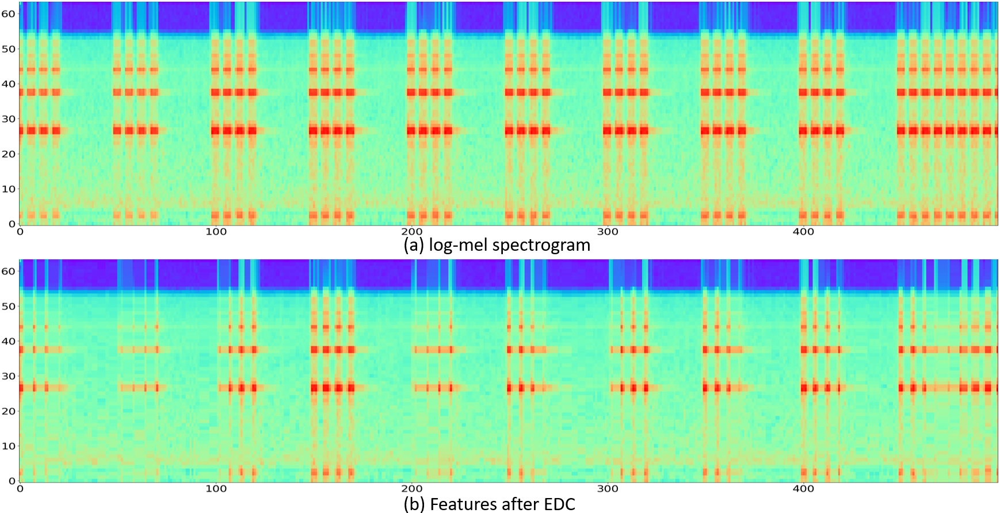

### Sample 3
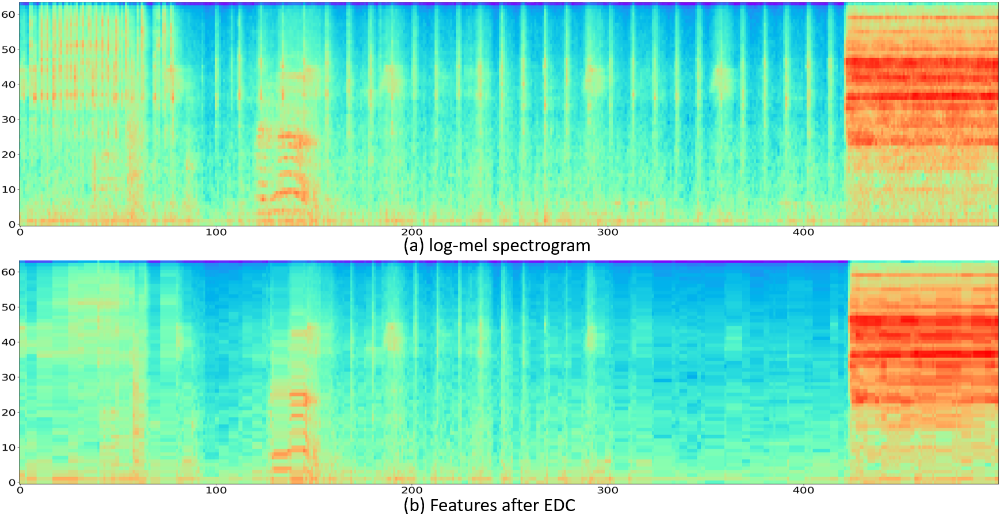
 
